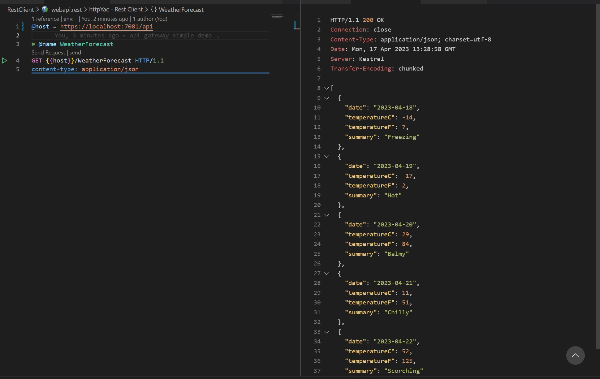
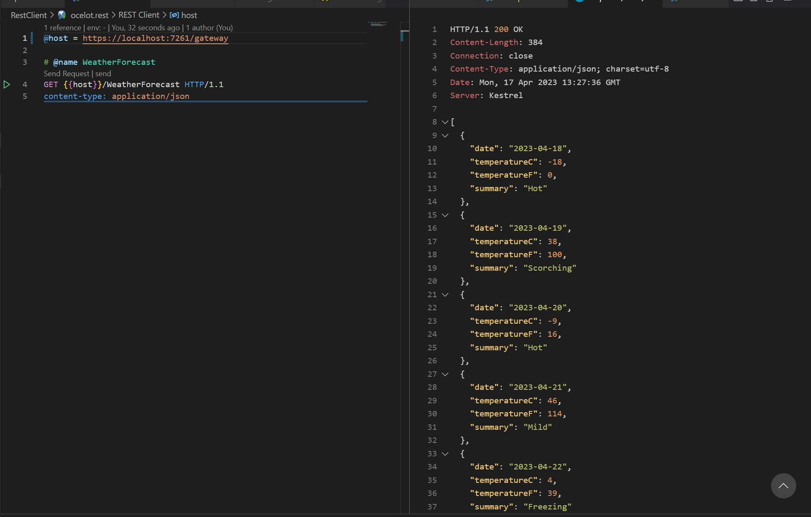

Api Gateay Simple Demo

Tech Stack

- [x] Ocelot
- [x] YARP (Reverse Proxy)
- [x] Routing
- [x] Authentication
- [x] Rate Limiting
- [x] Caching /SPAN
- [ ] Retry policies / QoS
- [x] Load Balancing
- [ ] Logging
- [x] Rest Api
- [x] Minimal Api
- [x] TYE
- [ ] GRPC
- [ ] LettecyEncrypt
- [ ] Service Fabric
- [ ] WebSocket

## Simple api



## Ocelot



```javascript
$ dotnet new sln -o apigateway-simple-demo

# setup webapi
$ dotnet new webapi -o Presentation.WebApi

$ dotnet sln add .\Presentation.WebApi\Presentation.WebApi.csproj

# setup minimal api
$ dotnet new web -n Minimal.Api

# add carter
$ dotnet add .\Minimal.Api\ package carter

$ dotnet sln add .\Minimal.Api\Minimal.Api.csproj

$ dotnet add .\Minimal.Api\ package Microsoft.Extensions.Configuration.Json

$ dotnet build

$ dotnet run --project .\Presentation.WebApi\

# run swagger
http://localhost:5166/swagger/index.html

# add ocelot api gateway project
$ dotnet new webapi -o Ocelot.ApiGateway

$ dotnet sln add .\Ocelot.ApiGateway\Ocelot.ApiGateway.csproj

# add api gateway package
$ dotnet add .\Ocelot.ApiGateway\ package Ocelot

# setup ocelot.json for downstream(webapi) and upstream(ocelot)

# run ocelot
$ dotnet run --project .\Ocelot.ApiGateway\

# authentication
$ dotnet add  .\Ocelot.ApiGateway\ package Microsoft.AspNetCore.Authentication.JwtBearer

# cache
$ dotnet add  .\Ocelot.ApiGateway\ package Ocelot.Cache.CacheManager

# check current sdk
dotnet --list-sdks

# check user-jwts
$ dotnet user-jwts

# generate token base on jwt confi
$ dotnet user-jwts create --name 'demo' --audience 'jeff.chen' --scope 'demo:secrets'

# decode token
https://jwt.ms/

# token list
$ dotnet user-jwts list

# clear token
$ dotnet user-jwts clear

# add Yarp api gateway project
$ dotnet new webapi -o Yarp.ApiGateway

# add to sln
$ dotnet sln add .\Yarp.ApiGateway\Yarp.ApiGateway.csproj

# add yarp package
$ dotnet add .\Yarp.ApiGateway\ package Yarp.ReverseProxy

# add tye
$ dotnet tool install --global Microsoft.Tye --version 0.11.0-alpha.22111.1

# init tye
$ tye init

# tye run Is a Single Command Running All Services
$ tye run

# tye debug
$ tye run --debug backend

# tye docker
$ tye run --docker

# tye deploy
# tye deploy --interactive
```
